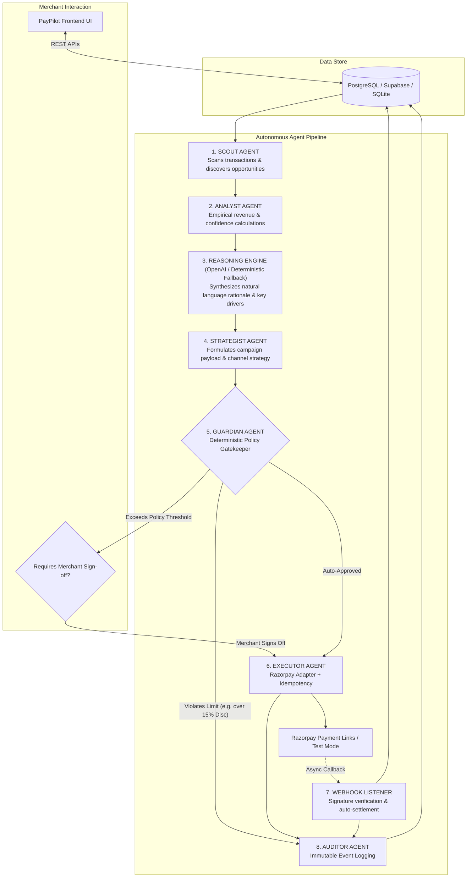

# PayPilot Backend — AI Revenue Operating System

PayPilot is an AI Revenue Operating System for merchants built for the **Razorpay Buildathon**. It analyzes merchant payment flows, customer lifecycle trajectories, catalog structures, and order histories to discover uncaptured revenue opportunities, formulate tactical action plans, enforce deterministic financial policies via a **Guardian** layer, execute approved actions through Razorpay, and record every state transition in an immutable audit log.

---

## Architecture & Agent Pipeline

PayPilot enforces strict governance by separating reasoning, strategy formulation, deterministic policy enforcement, execution, and audit logging into distinct typed agents:



---

## Agent Responsibilities & Boundary Invariants

| Agent | Responsibility | Output / Governance |
|---|---|---|
| **SCOUT** | Identifies raw revenue leakage (failed payments, dormant accounts, upsell candidates, mandate drops). | Candidate Opportunity List |
| **ANALYST** | Evaluates empirical data, calculates potential revenue, confidence score (0-1.0), and risk level. | Enriched Opportunity with Evidence |
| **LLM REASONER** | Produces natural language summaries and key analytical drivers with **automatic deterministic fallback**. | Explanation, Key Factors, `reasoning_source` |
| **STRATEGIST** | Recommends optimal campaign parameters, channel selection, discount budgets, and timing. | Proposed Action (`AIAction`) |
| **GUARDIAN** | Deterministic gatekeeper enforcing merchant policy constraints (caps on discounts, budget, exposure). | `approved` \| `blocked` \| `requires_approval` |
| **EXECUTOR** | Dispatches transactions to Razorpay (payment links, refunds, mandate updates) with idempotency. | Razorpay Reference / Execution Status |
| **WEBHOOKS** | Ingests Razorpay webhook callbacks with HMAC-SHA256 signature verification & deduplication. | Updated Payment / Action Status |
| **AUDITOR** | Records immutable chronological log entries for every discovery, decision, check, and execution. | Audit Trail (`AuditEvent`) |

> [!IMPORTANT]
> **LLM Boundary Invariant**: The LLM is **never** permitted to authorize financial actions or bypass the Guardian. Even if an LLM generates an aggressive recommendation (e.g., 30% discount), the Guardian deterministically blocks the action if it exceeds merchant policies.

---

## Technology Stack

- **Framework**: Python 3.11+ / FastAPI
- **Data Validation**: Pydantic v2
- **ORM & Database**: SQLAlchemy 2.x / Supabase PostgreSQL (with SQLite fallback for local offline development)
- **Database Drivers**: `psycopg2-binary`, `asyncpg`
- **LLM Integration**: OpenAI Python SDK (`gpt-4o-mini` with graceful deterministic fallback)
- **Payment Gateway**: Razorpay Test Mode & Mock Adapter
- **Testing**: `pytest`, `pytest-asyncio`, `httpx` (34 passing tests)
- **Server**: Uvicorn

---

## Directory Structure

```
backend/
├── app/
│   ├── main.py                  # FastAPI entry point, lifespan, CORS & health probe
│   ├── api/                     # REST API routers
│   │   ├── dashboard.py         # GET /api/dashboard
│   │   ├── opportunities.py     # GET /api/opportunities, GET /api/opportunities/{id}, POST /api/opportunities/scan
│   │   ├── customers.py         # GET /api/customers, GET /api/customers/{id}
│   │   ├── simulator.py         # POST /api/simulate
│   │   ├── guardian.py          # GET /api/guardian/policies, PUT /api/guardian/policies
│   │   ├── actions.py           # POST /api/actions/preview, approve, execute, GET /api/actions
│   │   ├── audit.py             # GET /api/audit
│   │   ├── commerce.py          # GET /api/commerce-readiness
│   │   └── webhooks.py          # POST /api/webhooks/razorpay (HMAC-SHA256 verified)
│   ├── agents/                  # Multi-agent orchestrators
│   │   ├── scout.py
│   │   ├── analyst.py
│   │   ├── strategist.py
│   │   ├── guardian.py
│   │   ├── executor.py
│   │   └── auditor.py
│   ├── services/                # Business logic engines & adapters
│   │   ├── opportunity_engine.py
│   │   ├── simulation_engine.py
│   │   ├── action_service.py
│   │   ├── guardian_service.py
│   │   ├── audit_service.py
│   │   ├── razorpay_service.py  # Mock & Test Mode Razorpay adapters
│   │   ├── webhook_service.py   # Webhook signature verification & idempotency
│   │   ├── commerce_service.py
│   │   └── reasoning_service.py # OpenAI LLM + Deterministic fallback engine
│   ├── models/                  # SQLAlchemy 2.0 ORM models
│   │   ├── merchant.py
│   │   ├── customer.py
│   │   ├── product.py
│   │   ├── order.py
│   │   ├── payment.py
│   │   ├── opportunity.py
│   │   ├── ai_action.py
│   │   ├── guardian_policy.py
│   │   ├── audit_event.py
│   │   └── processed_webhook_event.py # Webhook idempotency ledger
│   ├── schemas/                 # Pydantic v2 schemas
│   ├── core/                    # Core configuration, DB engine & custom error handlers
│   └── data/
│       └── seed.py              # Deterministic Kora Retail demo dataset
├── tests/                       # Comprehensive Pytest test suite (34 test cases)
│   ├── test_health.py
│   ├── test_opportunities.py
│   ├── test_llm_reasoning.py
│   ├── test_guardian.py
│   ├── test_simulator.py
│   ├── test_actions.py
│   ├── test_state_machine.py
│   ├── test_razorpay_test_mode.py
│   ├── test_webhooks.py
│   ├── test_audit.py
│   └── test_dashboard_and_commerce.py
├── requirements.txt
├── .env.example
└── README.md
```

---

## Quickstart & Installation

### 🚀 Quickstart for Windows (1-Click Run)

Simply double-click `run.bat` (or `start.bat`) or run from command prompt / PowerShell:

```cmd
run.bat
```

This automated script will:
1. Verify Python and Node.js/npm prerequisites.
2. Initialize `.env` and `frontend/.env` configuration files.
3. Install backend (`pip`) and frontend (`npm`) dependencies if needed.
4. Seed the database with the Kora Retail dataset.
5. Launch FastAPI backend (`http://localhost:8000`) and Vite frontend (`http://localhost:8080`) in separate processes.
6. Automatically open the Web UI and Swagger Docs in your browser.
7. Provide a launcher menu to run tests, re-seed data, or stop all services.

To stop all PayPilot services at any time, run:
```cmd
stop.bat
```

---

### Manual Setup (Cross-Platform)

### 1. Set Up Virtual Environment

```bash
# Clone repository
git clone <repo_url>
cd PayPilot

# Create and activate virtual environment
python -m venv .venv
# On Windows:
.venv\Scripts\activate
# On macOS/Linux:
source .venv/bin/activate

# Install dependencies
pip install -r requirements.txt
```

### 2. Configure Environment Variables

Copy `.env.example` to `.env`:

```bash
cp .env.example .env
```

Key environment configuration variables:

```ini
# Database Connection (Supabase PostgreSQL or local SQLite)
DATABASE_URL=sqlite:///./paypilot.db

# LLM Reasoning Engine (Optional: system automatically falls back to deterministic rules if missing)
OPENAI_API_KEY=your_openai_api_key_here
LLM_PROVIDER=openai
LLM_MODEL=gpt-4o-mini
LLM_TIMEOUT_SECONDS=8.0

# Razorpay Integration Mode ('mock' for demo/offline, 'test' for Razorpay Test Mode)
RAZORPAY_MODE=mock
RAZORPAY_KEY_ID=rzp_test_xxxx
RAZORPAY_KEY_SECRET=your_test_secret
RAZORPAY_WEBHOOK_SECRET=your_webhook_secret

# CORS Allowed Origins
ALLOWED_ORIGINS=http://localhost:3000,http://localhost:5173,http://127.0.0.1:3000
```

### 3. Seed Deterministic Merchant Data

Populate the database with the **Kora Retail** dataset (₹8,42,300 Revenue, 1,024 Customers, 4,892 Transactions, ₹38,400 Recoverable Cashflow, 27 AI Opportunities):

```bash
python -m backend.app.data.seed
```

### 4. Run the FastAPI Server

```bash
uvicorn backend.app.main:app --host 0.0.0.0 --port 8000 --reload
```

Interactive OpenAPI Swagger UI: `http://localhost:8000/docs`

---

## Razorpay Integration & Webhooks

### Switching between Mock and Test Mode

- **`RAZORPAY_MODE=mock`**: Runs completely offline, generating deterministic payment links (`https://rzp.io/i/plink_mock_xxxx`) and mock references.
- **`RAZORPAY_MODE=test`**: Makes authenticated API requests to `https://api.razorpay.com/v1/payment_links` using your Razorpay Test Key ID and Secret. Rupee amounts are automatically converted to paise.

### Razorpay Webhook Configuration

1. In Razorpay Dashboard, set Webhook URL to: `https://<your-backend-domain>/api/webhooks/razorpay`
2. Subscribe to events:
   - `payment_link.paid`
   - `payment_link.cancelled`
   - `payment.failed`
3. Configure `RAZORPAY_WEBHOOK_SECRET` in `.env`.
4. PayPilot verifies the HMAC-SHA256 signature in the `X-Razorpay-Signature` header and enforces **event idempotency** using the `processed_webhook_events` ledger.

---

## Running Automated Tests

Run the full pytest suite (no external credentials required):

```bash
pytest backend/tests -v
```

All 34 test cases cover:
- Health check & database probe
- LLM structured reasoning, missing key fallback, malformed JSON fallback, timeout fallback, and Guardian boundaries
- Payment recovery, customer win-back, and upsell detection
- Guardian policy approvals, discount blocking, and manual approval gates
- Financial simulator calculation model & ROI breakdown
- Action state machine transitions (`BLOCKED`, `PROPOSED`, `AWAITING_APPROVAL`, `EXECUTED`)
- Mock & Test Mode Razorpay adapters
- Webhook HMAC signature verification, `payment_link.paid` settlement, duplicate event deduplication, and audit trail creation
